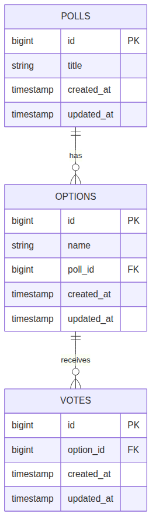

#+TITLE: Poll App — Database Schema
#+OPTIONS: toc:nil

* Diagram

* Source

Regenerate the image with =C-c C-c= on the block below
(needs =ob-mermaid= + mermaid-cli), or from a shell:
=npx -p @mermaid-js/mermaid-cli mmdc -i schema.mmd -o schema.png=

#+begin_src mermaid :file schema.png
erDiagram
    POLLS ||--o{ OPTIONS : "has"
    OPTIONS ||--o{ VOTES : "receives"

    POLLS {
        bigint id PK
        string title
        timestamp created_at
        timestamp updated_at
    }

    OPTIONS {
        bigint id PK
        string name
        bigint poll_id FK
        timestamp created_at
        timestamp updated_at
    }

    VOTES {
        bigint id PK
        bigint option_id FK
        timestamp created_at
        timestamp updated_at
    }
#+end_src
